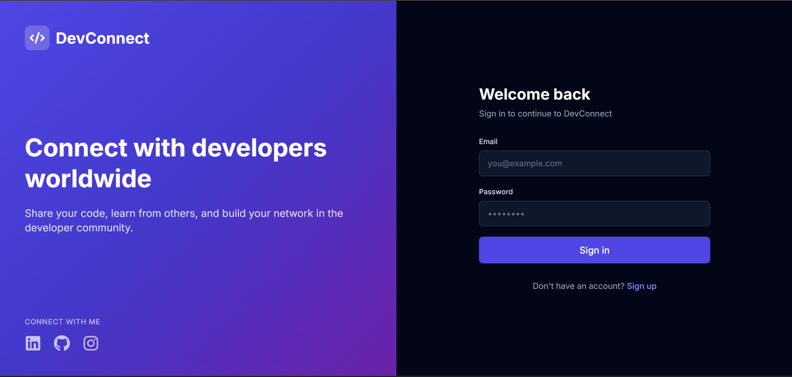
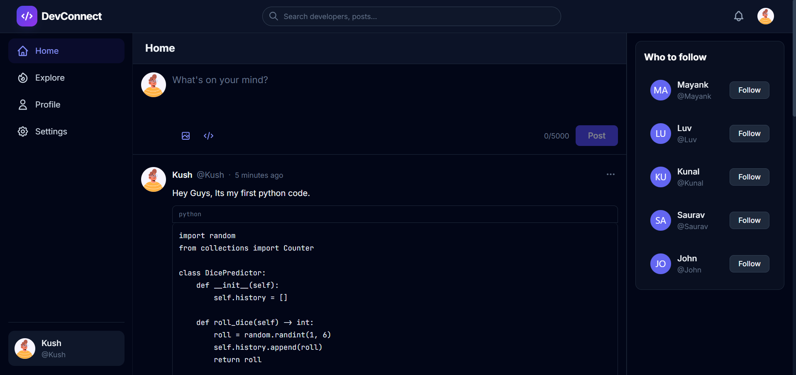
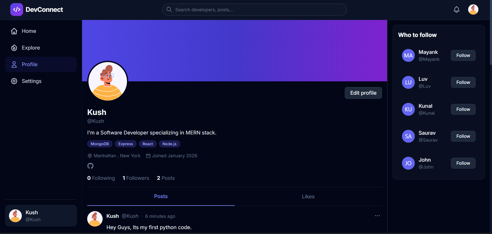
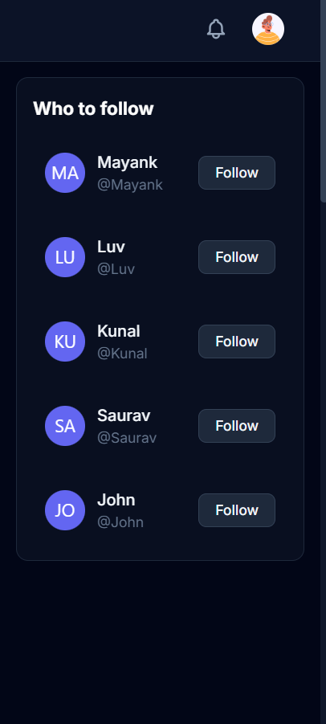

# ⚡ DevConnect


**DevConnect** is a full-stack social media platform designed specifically for developers. Share code snippets, connect with peers, discuss tech trends, and build your professional network.

🌐 **Live Demo:** (https://your-app.onrender.com)

---

## 📸 Screenshots

| Login Page | Home Feed |
|:---:|:---:|
|  |  |

| Profile Page | "Who to Follow" |
|:---:|:---:|
|  |  |

---

## 🚀 Features

* **Authentication:** Secure Login/Signup with JWT & HTTP-Only cookies.
* **Create Posts:** Share text and images (Cloudinary integration).
* **Social Interactions:** Like, Comment, and Save posts.
* **Follow System:** Follow/Unfollow developers to curate your feed.
* **Smart Suggestions:** "Who to follow" sidebar with random recommendations.
* **Responsive Design:** Fully mobile-optimized with a custom bottom navigation bar.
* **User Profiles:** Edit bio, skills, and social links (GitHub, LinkedIn).
* **Dark Mode:** Sleek, developer-friendly dark UI.

---

## 🛠️ Tech Stack

**Frontend:**
* React.js (Vite)
* Redux Toolkit (State Management)
* Tailwind CSS (Styling)
* React Icons & React Hot Toast

**Backend:**
* Node.js & Express.js
* MongoDB & Mongoose (Database)
* Cloudinary (Image Storage)
* JSON Web Tokens (Auth)

---

## ⚙️ Installation & Run Locally

1.  **Clone the repository**
    ```bash
    git clone (https://github.com/kushyarwar/DevConnect.git)
    cd DevConnect
    ```

2.  **Install Dependencies**
    ```bash
    # Install server dependencies
    cd server
    npm install

    # Install client dependencies
    cd ../client
    npm install
    ```

3.  **Environment Variables**
    Create a `.env` file in the `server` folder and add:
    ```env
    PORT=5000
    MONGO_URI=your_mongodb_connection_string
    JWT_SECRET=your_jwt_secret
    CLOUDINARY_CLOUD_NAME=your_cloud_name
    CLOUDINARY_API_KEY=your_api_key
    CLOUDINARY_API_SECRET=your_api_secret
    NODE_ENV=development
    ```

4.  **Run the App**
    ```bash
    # Run Backend (from server folder)
    npm run server

    # Run Frontend (from client folder)
    npm run dev
    ```

---

## 🤝 Contributing

Contributions are welcome!
1.  Fork the project
2.  Create your feature branch (`git checkout -b feature/AmazingFeature`)
3.  Commit your changes (`git commit -m 'Add some AmazingFeature'`)
4.  Push to the branch (`git push origin feature/AmazingFeature`)
5.  Open a Pull Request

---

## 👤 Author

**Kush**
* LinkedIn: (https://www.linkedin.com/in/kushyarwar)
* GitHub: (https://github.com/kushyarwar)